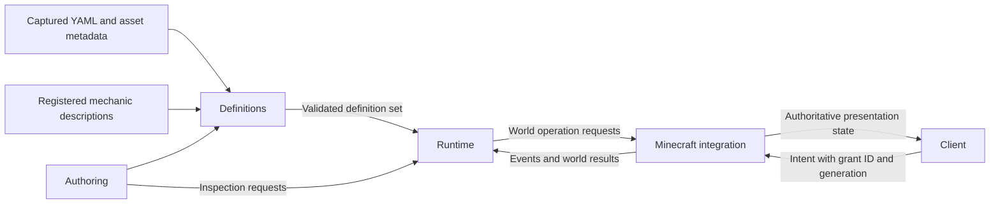
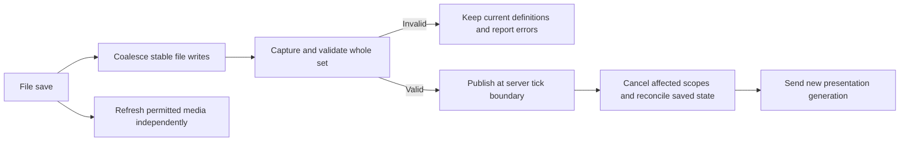

# Module design

Status: accepted design baseline under Q81-Q85, expanded by the complex-ability coverage requirement. This describes a Kotlin/Fabric implementation of the accepted policies, not code already present in the repository. Start with one mod project and package-level modules; separate build projects only when a concrete distribution or dependency need appears.

## Five modules

| Module | Small interface | Implementation it owns |
| --- | --- | --- |
| Definitions | Compile a captured pack set with a mechanic catalog into a validated immutable definition set, or return located diagnostics | YAML decoding, source locations, typed expressions, reference binding, parameter validation, composition, migration planning, and generated schema descriptions |
| Runtime | Handle an intent or event, advance simulation time, publish a validated definition set, and inspect current state | Activation lifecycle, player state, resources, cooldowns, statuses, progression, causal chains, bounded scheduling, source cleanup, and reconciliation |
| Minecraft integration | Translate native events and execute supported world operations with actual outcomes | Fabric hooks, entity and projectile adapters, navigation, native combat, terrain ownership and recovery, persistence I/O, networking, and server asset delivery |
| Client | Receive versioned presentation state and submit player intents | Ability pages, targeting feedback, talent/class screens, summon orders, HUD settings, installed renderers, generic sound playback, resource refresh, and operator inspection views |
| Authoring | Validate a pack snapshot, export schemas, and format inspection or trace results | Offline validation entrypoint, readable and structured reports, generated references, and trace presentation |

The compiler and runtime model do not contain Minecraft entity objects, client renderer classes, or YAML maps. They use immutable definitions, explicit IDs, typed values, and scoped state references. Minecraft integration resolves world/entity handles only when operations execute. A missing handle is an ordinary target-loss outcome.

This is a flow diagram, not a cyclic compilation dependency. Definition and operation-contract types live with Definitions. Runtime depends on those contracts. Minecraft integration supplies world adapters and composes the runtime at startup. Client and Authoring consume only their required contracts. Runtime never imports their implementations.

## Mechanic registration and locality

A mechanic description declares its namespaced type ID, supported execution category, fields and defaults, target/context requirements, numeric units, and lifecycle obligations. Compilation binds its values and references once. Execution receives typed configuration and a bounded execution context; it does not look up arbitrary YAML fields.

Keep a mechanic's description, handler, and focused examples in one feature directory. Pure mechanics such as resource changes and conditions live with Runtime. World mechanics such as terrain placement live with Minecraft integration. Startup registers both through the same catalog. A new Kotlin effect should add one handler and its description plus registration, not change the parser, HUD, progression code, and documentation generator independently.

Separate effect, condition, selector, and event-adjustment contracts because their results and valid contexts differ. Do not create a base class for every operation or one extension hook per property. A condition returns a typed result and a failure reason. A selector returns bounded typed handles. An effect returns an outcome and any owned continuations. Before-event adjustments can only request the fields declared mutable by that event.

Temporary effects register cleanup with their source scope when created. Cleanup does not depend on finding the original YAML file later. Durable world effects include enough versioned recovery data to finish after definitions disappear. Registrations that create ongoing effects without a cleanup contract fail validation.

The offline authoring tool reads exported mechanic descriptions produced from the same registration metadata. It can validate field structure and references without launching Minecraft. Registry-dependent and adapter-specific checks require matching metadata or server validation and are explicitly reported as unverified when unavailable. The offline tool must not claim that generic schema validation proves a world operation executable.

## Complex composition as a runtime responsibility

[ability-coverage.md](ability-coverage.md) is a v1 release contract. Implement typed result binding, bounded target history, event correlation, named timers, phase/parallel scheduling, and owned area controllers as reusable runtime capabilities. Common mechanics must not depend on a handler written for one class or named ability. The existing five modules own this work; it does not require a new module per pattern.

The compiler checks result availability across branches, target type and cardinality, finite iteration bounds, event-handle compatibility, and the lifetime of references crossing delayed steps. Parallel branches have separate local bindings and share the parent's work allowance. Dynamic subscriptions are owned handles, cancelled with their scope. Short-lived outcome receipts close same-step races between creation and waiting for an effect's result.

Named timers carry generations so a stale expiry cannot erase newer combo state. Chains and areas own bounded internal membership/history rather than exposing arbitrary mutable collections to manifests. Spatial selection and client previews derive from one typed shape description. Client previews never determine hits or override the server's validation.

Maintained controllers use bounded setup and bounded scheduled pulse batches. A controller may stay active over many ticks under its lifecycle policy; historical work does not accumulate until an otherwise valid toggle fails. Delayed descendants retain their pulse's budget and ancestry. Only registered controllers can start fresh batches, with global and per-owner limits. Cancellation and required recovery remain reserved work.

Combat policies such as barrier absorption are typed atomic adjustments at declared native phases. They capture committed outcomes, distinguish prevented damage from absorbed damage and health loss, and queue ordinary callbacks after commitment. Temporary forms use the same contribution-composition implementation as progression empowerments, with independent source lifetimes and preserved logical ability identity.

## Activation and event execution

The server receives an intent naming the player, logical ability grant, input phase, and definition generation. The authenticated connection determines the player identity. The server resolves the active grant and effective definition, verifies ownership and prerequisites, resolves required targets, and checks resources, cooldowns, and capacity.

Commit costs, available uses, and cooldowns once under the accepted timing rule for that activation mode. Failed starts commit nothing. A successful start receives a source scope containing owner, source class or summon, logical grant, definition generation, and activation identity. Cancellation removes ongoing state through that scope; completed world outcomes are not reversed by pretending the whole sequence was a transaction.

Each effect observes current values unless it refers to a snapshot. World operations return their actual outcome, such as health changed, damage prevented, or positions changed. Those outcomes feed after-reactions and progression. Missing targets skip the affected work under Q72. Invalid arithmetic produces a source-located failure for the affected step. Unexpected handler failures cancel the affected execution, retain required cleanup, and report diagnostics without taking down unrelated abilities.

Before-hooks run only where the native adapter can still affect the action. After-hooks observe its final result. Use explicit action tokens when a world operation also produces a native callback: the adapter and runtime must report the same action once, not once as an effect and again as a Fabric event. External native actions also enter the event model through the adapter.

Immediate reactions run in priority order, with stable logical IDs breaking ties. Finish the current effect and its immediate reaction work before advancing the containing sequence. Delayed and projectile continuations retain causal ancestry. A reaction key uses owner/source identity, logical grant, and reaction ID; creating a new activation ID cannot evade the reentry check. Siblings inherit their parent ancestry independently.

## State and progression reconciliation

One authority owns resource balances, cooldowns, available charges, custom state, and progression records. No HUD or mechanic keeps a second mutable copy. Inactive classes retain state. Offline player timers and absent-companion timers pause. Player cooldowns progress while online even when a class is inactive; resource regeneration follows active grants.

Empowerments compile into an effective definition for the player's valid selections. Independent contributions combine; numerical additions precede multipliers and bounds. Ambiguous replacements fail validation. Replacing the implementation of an ability keeps its logical grant identity. Changing a tree removes invalid dependent choices together, refunds the points actually spent, and removes their behavior.

XP totals, one-time award identities, and historical point purchases survive edits. Level calculation uses the current curve. The reward ledger distinguishes original earning event, rule, destination track, and recipient. It deduplicates duplicate delivery of one award without suppressing intentionally separate rules. Full reward per eligible recipient remains the default. Summons and projectiles attribute rewards to their owning player.

Removed definitions make compatible saved data dormant, not deleted. One-to-one migrations move records once and reject conflicting destinations. Offline records apply retained migrations when loaded. Unknown or incompatible stored data is retained with diagnostics for recovery; it is not silently replaced with initial values.

## Reload publication

Q85 establishes the concrete sequence below. Nothing requires a reload command or confirmation.

The candidate contains the actual bytes that were validated, their content hashes, and referenced dependency versions. A later edit cannot replace those bytes between validation and publication. Pure parsing and binding can run away from the server tick; checks that need live registries use a captured registry view or return to the server thread.

The server publishes definitions and player reconciliation as one authoritative transition. It retains the previous generation if validation or reconciliation planning fails. Plan the transition before mutating gameplay. All required cleanup is registered before new passives or casts can start. Large terrain restoration may continue as bounded recovery work; publication must not lose its ownership records or make stale callbacks active again.

The coalescing interval is approximately 200 ms of stable file writes, followed by validation and publication at the next server tick. This is not a latency guarantee; larger packs take longer to validate. A coherent valid intermediate save is a real edit. Authors can use editor atomic saves and coherent file changes; there is no hidden manual apply step. Invalid partial edits retain the last working set.

Clients receive the new generation automatically. Inputs from stale generations are rejected without spending resources, followed by resynchronization. The server does not wait for optional media or every client to acknowledge before applying valid gameplay definitions. Client asset refresh can take longer and uses built-in visual fallbacks.

## Recovery and persistence

The runtime models mutations to persistent player records; the Minecraft adapter stores them in the world through a versioned persistence interface. Record schemas and migrations are separate from manifest format versions. Persistence must not depend on the original class definition still being loaded.

For temporary terrain, write recoverable ownership and original-state information before changing the world position. Maintain generation or operation IDs so recovery can distinguish an owned change from a later external write. On chunk load, resolve pending cleanup before normal interaction with the affected positions. Save enough information to skip expired covered layers and restore the correct surviving layer. Tests must cover interruption between recording intent, editing the block, and recording completion.

Vanilla chunk saves and Archetype's records do not automatically form one storage transaction. The implementation must coordinate saves or use a journal protocol that reconciles partial saves without guessing from block-value equality alone. If ownership cannot be established, preserve later world data and retain a recovery record for inspection. Do not claim crash-proof restoration solely because a block snapshot was written.

Persistent companions have a durable logical identity and a current body incarnation. Native entity data carries the identity and incarnation. On load, the adapter reconciles against the authoritative record and removes obsolete duplicate bodies without replaying death loot or other gameplay callbacks. Q83 settles user-visible dismissal and recall behavior. Health and real inventory are part of continuity, not freshly generated on recall.

Q84 requires durable item return and block-data recovery records. A record is consumed only after a successful delivery or explicit recovery action. Repeated retries must not duplicate items. Recovery remains available when an originating definition is removed. Automatic cleanup never guesses an inventory's owner or overwrites a later player's block to make restoration appear successful.

## Client assets and presentation

The server synchronizes resolved presentation data and authoritative state, not arbitrary code for clients to evaluate. HUD labels, effective costs, cooldowns, charges, talent requirements, and action availability come from the active definition generation. Client interpolation may make timers smooth, but it does not authorize actions.

Media transfer uses a bounded manifest of content hashes, namespaces, sizes, and supported resource kinds. Client preferences apply before downloading. Installed code exposes accepted media as client resources and schedules resource refresh. The exact transfer adapter can use the mod connection or a standard resource-pack delivery path; choose after integration validation without changing authoring semantics.

Custom audio can use the verified identifier-based client playback path after resources load. This avoids registering a new startup sound type for every authored sound name. New entity types, renderer logic, or animation capabilities still require an installed extension. Server control of a media path never grants arbitrary filesystem or URL access.

## Validation through the module interfaces

| Interface under test | Evidence needed before calling v1 complete |
| --- | --- |
| Definition compilation | Located errors, reference/parameter typing, generated-schema agreement, finite graphs, and predictable empowerment composition |
| Runtime intents and events | Exactly one cost/reward application, phase order, bounded recursion through delays, target loss, status cadence, and cleanup when handlers fail |
| Reconciliation and persistence | No edit refills, historical refunds, dormant state, offline migrations, companion duplication prevention, and recovery across interrupted writes |
| World adapters | Native combat semantics, real collision ordering, navigation ownership, terrain overlap and external edits, and real inventory continuity |
| Client and authoring | Dedicated-server class loading, stale-input rejection, HUD/talent state, media decline and refresh, new sound-name playback, and honest offline validation reports |

Use deterministic simulation adapters for runtime tests and a small real Fabric test environment for native behavior. Test through the same interfaces used by callers, not by reproducing private implementation details. Standalone documentation fragments are not required bundled gameplay content.

Implementation can proceed in dependency order: compiler and common model, runtime/state and composition, native effects and recovery, then client presentation and author tools, with integration checks throughout. All accepted capabilities, including progression, summon AI, terrain editing, and the complex-ability coverage matrix, remain v1 release requirements. Staging implementation does not defer them beyond v1. Every matrix scenario must be changed structurally through YAML and reloaded without a mod rebuild before its coverage is considered demonstrated.
